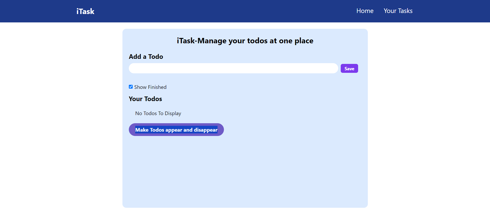

# Project Overview

 This is a simple single page Todolist-List (React+Typescript) project made by me. The todos are all fetched and saved in the mongodb atlas(cloud). The Features of this app are:-
- You can add daily todos in it
- You can edit and delete the todos from it
- You can check and uncheck todosas completed or not

<br/>

# Getting Started

## **Local Setup**
Fork the repository at-https://github.com/mohit-bhandari45/TodoList-React-Typescript to your account

Then clone the forked repository, by writing the following line into the terminal

``` 
git clone https://github.com/<your-username>/TodoList-React-Typescript.git 
```
Then navigate to the cloned repository on your local system

``` 
cd TodoList-React-Typescript
```
 
### **ENV Variables**
```
PORT=3000
MONGO_URI=
```

### **Adding data to MONGO_URI**
You can either spin up a local/Docker(further discuused how to setup) instance or can use MongoDB Atlas (Recommended).

Here's the sample uri which can be made in the mongodb atlas(cloud)
```
mongodb+srv://mohitbhandari852:<password>@todos.rjcstoi.mongodb.net/ 
```


### **Frontend and Backend run**

Navigate to the front and backend individually, install all the packeages by npm i and run individual servers by running these commands in different tabs

``` 
cd Frontend
npm run dev
```
``` 
cd Backend
npx tsc
node dist/server.js
```

## **Docker Setup**

You can run docker containers either individually in two different terminals or by running a single command as well

``` 
Open terminal into you local system
```

### **Individual front-end and backends containers**

Run front end and backend docker container individually in different terminal tabs by running following commands
```
Front-end command:- docker run -it -p 5173:5173 <image name>
Back-end command:- docker run -it -p 3000:3000 <image name>
```

### **Run front-end and back-end at once**
Run both front-end and back-end at once in one tab by running this command:- 
```
docker compose up
```

### Enjoy you application now!